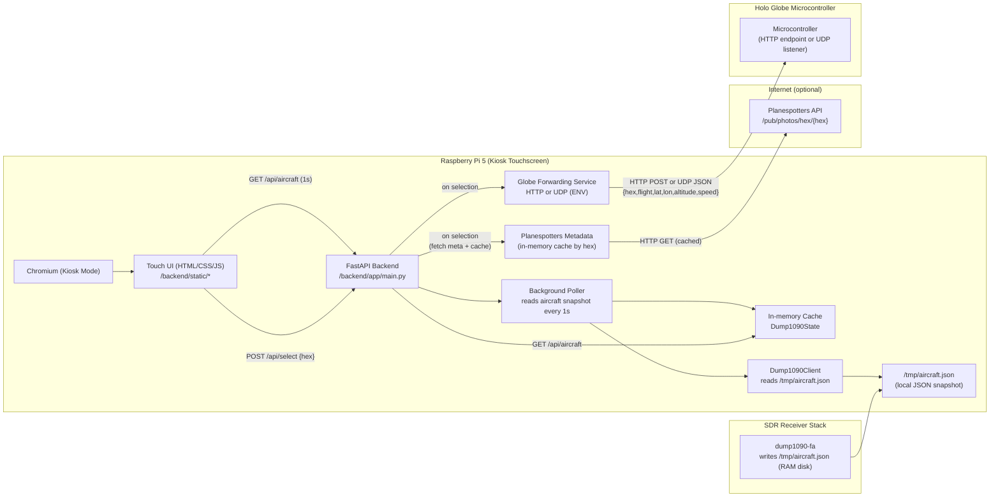

```mermaid
%% Application architecture (render with Mermaid / mermaid.js)
flowchart LR
  subgraph RasPi["Raspberry Pi 5 (Kiosk Touchscreen)"]
    Browser["Chromium (Kiosk Mode)"]
    UI["Touch UI (HTML/CSS/JS)\n/backend/static/*"]
    API["FastAPI Backend\n/backend/app/main.py"]
    Poller["Background Poller\nreads aircraft snapshot every 1s"]
    Cache["In-memory Cache\nDump1090State"]
    DumpClient["Dump1090Client\nreads /tmp/aircraft.json"]
    Snapshot["/tmp/aircraft.json\n(local JSON snapshot)"]
    MetaSvc["Planespotters Metadata\n(in-memory cache by hex)"]
    GlobeSvc["Globe Forwarding Service\nHTTP or UDP (ENV)"]
  end

  subgraph SDR["SDR Receiver Stack"]
    Dump1090["dump1090-fa\nwrites /tmp/aircraft.json (RAM disk)"]
  end

  subgraph Internet["Internet (optional)"]
    Planespotters["Planespotters API\n/pub/photos/hex/{hex}"]
  end

  subgraph Globe["Holo Globe Microcontroller"]
    MCU["Microcontroller\n(HTTP endpoint or UDP listener)"]
  end

  Browser --> UI
  UI -->|"GET /api/aircraft (1s)"| API
  UI -->|"POST /api/select {hex}"| API

  API --> Poller
  Poller --> Cache
  Poller --> DumpClient
  DumpClient --> Snapshot
  Dump1090 --> Snapshot
  API -->|"GET /api/aircraft"| Cache

  API -->|"on selection\n(fetch meta + cache)"| MetaSvc
  MetaSvc -->|"HTTP GET (cached)"| Planespotters

  API -->|"on selection"| GlobeSvc
  GlobeSvc -->|"HTTP POST or UDP JSON\n{hex,flight,lat,lon,altitude,speed}"| MCU
```
