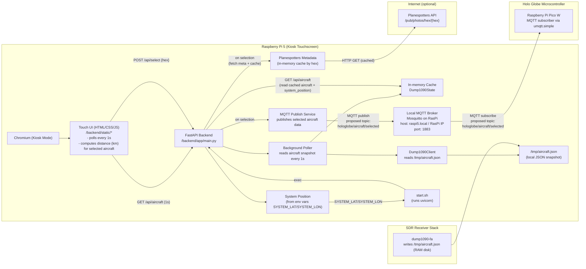

```mermaid
%% Application architecture (render with Mermaid / mermaid.js)
flowchart LR
  subgraph RasPi["Raspberry Pi 5 (Kiosk Touchscreen)"]
    Browser["Chromium (Kiosk Mode)"]
    UI["Touch UI (HTML/CSS/JS)\n/backend/static/*\n- polls every 1s\n- computes distance (km) for selected aircraft"]
    API["FastAPI Backend\n/backend/app/main.py"]
    Poller["Background Poller\nreads aircraft snapshot every 1s"]
    Cache["In-memory Cache\nDump1090State"]
    DumpClient["Dump1090Client\nreads /tmp/aircraft.json"]
    Snapshot["/tmp/aircraft.json\n(local JSON snapshot)"]
    SysPos["System Position\n(from env vars SYSTEM_LAT/SYSTEM_LON)"]
    MetaSvc["Planespotters Metadata\n(in-memory cache by hex)"]
    GlobeSvc["MQTT Publish Service\npublishes selected aircraft data"]
    Broker["Local MQTT Broker\nMosquitto on RasPi\nhost: raspi5.local / RasPi IP\nport: 1883"]
    StartScript["start.sh\n(runs uvicorn)"]
  end

  subgraph SDR["SDR Receiver Stack"]
    Dump1090["dump1090-fa\nwrites /tmp/aircraft.json (RAM disk)"]
  end

  subgraph Internet["Internet (optional)"]
    Planespotters["Planespotters API\n/pub/photos/hex/{hex}"]
  end

  subgraph Globe["Holo Globe Microcontroller"]
    MCU["Raspberry Pi Pico W\nMQTT subscriber via umqtt.simple"]
  end

  Browser --> UI
  UI -->|"GET /api/aircraft (1s)"| API
  UI -->|"POST /api/select {hex}"| API

  API --> Poller
  Poller --> Cache
  Poller --> DumpClient
  DumpClient --> Snapshot
  Dump1090 --> Snapshot
  API -->|"GET /api/aircraft\n(read cached aircraft + system_position)"| Cache
  API --> SysPos
  SysPos -->|"SYSTEM_LAT/SYSTEM_LON"| StartScript

  API -->|"on selection\n(fetch meta + cache)"| MetaSvc
  MetaSvc -->|"HTTP GET (cached)"| Planespotters

  API -->|"on selection"| GlobeSvc
  GlobeSvc -->|"MQTT publish\nproposed topic:\nhologlobe/aircraft/selected"| Broker
  Broker -->|"MQTT subscribe\nproposed topic:\nhologlobe/aircraft/selected"| MCU

  StartScript -->|"exec"| API
```
